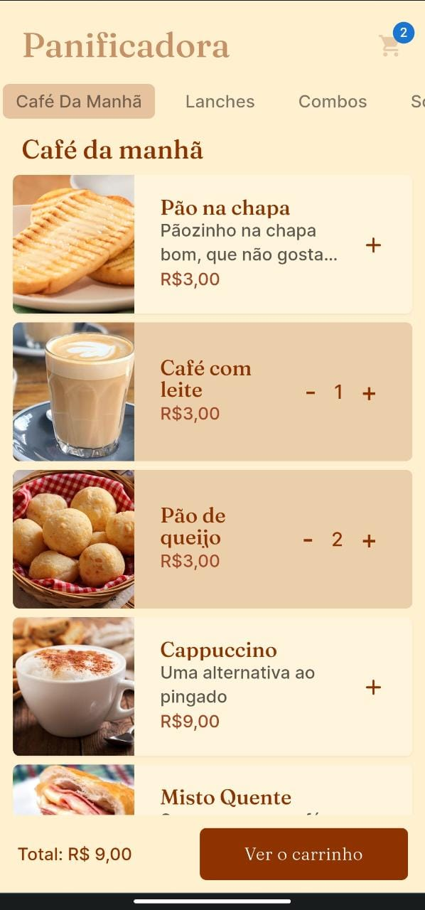
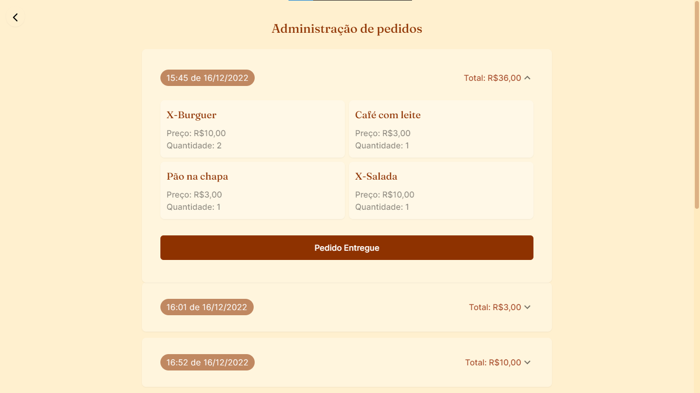

## Motivação

Uma vez eu fui cedo tomar café na padaria, só tinha uma garçonete avisando a cozinha os pedidos, e todas as mesas estavam cheias, e por ser tantos pedidos, a chance de ela esquecer alguma coisa existia. Claro que a pessoa ia lá cobrar depois, mas afim de evitar esse desgaste dos dois lados. Criei esse sistema de pedidos afim de facilitar a comunicação dos clientes com a cozinha.

## Como foi pensado

Eu pensei no seguinte: Colocar um QRCode no canto da mesa e quem escaneasse ele, levaria para o cardápio, da padaria. (QRCode de mesa já existe em alguns lugares, mas sempre levava para um pdf do cardápio, e isso me frustrou bastante).

 

Bom, esse é diferente, cada QRCode teria um identificador com o número da mesa, para deixar certeiro a entrega do que você pediu. A ideia do site não é ser um IFood de padaria, e sim um cardápio digital para quem gostar de consumir dentro da padaria, como pedir um lanche, ou café, etc. É claro que pedidos mais simples não é preciso usar o cardápio, mas para uma família ou ir comer com amigos, seria mai viável ter algo digitalizado de fato.

### Cardápio do Cliente 

## Sistema de armazenamento 

- O banco de dados foi feito com mongodb
- Mongoose para poder manipular o banco
- Mongodb Atlas, para armazenar em nuvem, os pedidos

### LocalStorage 

O localStorage eu usei de duas maneiras: 

1. Armazenar os itens que forma selecionados, porém ainda não concluiu o pedido. Isso é importante caso a pessoa saia do site e não perca os itens que já foram selecionados.

2. Armazenar em cache, a lista do banco de dados. Quando carrega a página de administração, a aplicação bate no banco que retorna os dados dos pedidos. Porém isso acontecia sempre, mesmo que não houvesse novo pedido. Esse é um desgaste desnecessário (ir até o banco para mostrar as mesmas coisas). Então, usando o contextAPI do React, a primeira vez que carregar a tela de adm vai pegar do banco, porém numa segunda vez, se não houver novos pedidos, vai carregar os mesmos dados persistidos em cache no navegador.
**Esse Controle é feito com uma simples mudança de estado no contexto. O Next me permite fazer isso, por sua arquitetura de <a href="https://nextjs.org/docs/api-routes/introduction">API Routes</a>.**
    - Total/index.tsx (tem mudança do estado do contexto se vai recarregar o banco ou não);
    - pages/administration.tsx (faz as verificações se vai pegar novos dados ou usar o local);

## Sem Sistema de pagamentos

A padaria já tem seu sistema de pagamentos no caixa que geralmente usam comandas, então o site não precisa de sistema de pagamentos, quem está lidando com o recebimentos dos pedidos fica responsável por atrelar o valor do pedido à comanda do cliente. Isso também dá uma certa confiança ao cliente de que ele está pagando certo, já que no site tem os preços e o histórico do pedido dele.

## Visão da cozinha

O estabelecimento teria esse simples painel de controle para ver os pedidos, o preço total, a data e a mesa que foi pedido

Um hackzinho para ver esse painel, é só clicar no nome "Panificadora". É claro que um projeto real não seria assim, mas é só para vocês que estão vendo o projeto, não fiquem por fora de nada.
